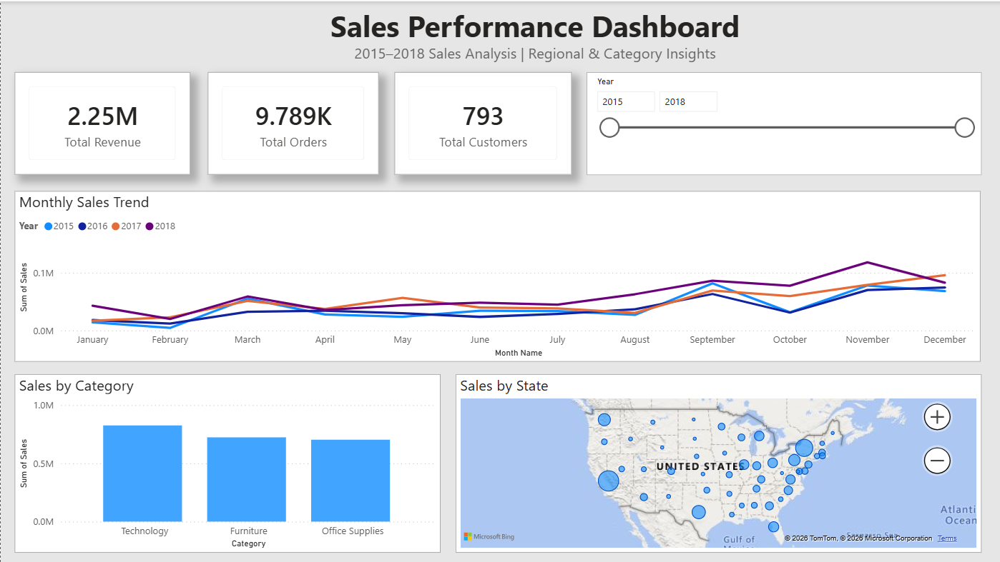

# Sales Data Analysis | Python, SQL, Power BI

## Overview
This project focuses on analyzing retail sales data to extract meaningful business insights. It involves data cleaning, SQL-based analysis, and dashboard creation to visualize key performance metrics.

---

## Objectives
- Analyze sales performance across regions, categories, and time
- Identify top customers and products
- Understand monthly sales trends
- Build an interactive dashboard for decision-making

---

## Tech Stack
- Python (Pandas) – Data cleaning and preprocessing  
- SQL (MySQL) – Data analysis and querying  
- Power BI – Data visualization and dashboard creation  

---

## Project Workflow

### 1. Data Cleaning (Python)
- Handled missing values (Postal Code)
- Converted date columns to proper datetime format
- Created additional columns (Year, Month, Month Name)
- Exported cleaned dataset

### 2. Data Analysis (SQL)
- Total revenue calculation
- Top cities, customers, and products analysis
- Category and region-wise revenue breakdown
- Monthly sales trend analysis

### 3. Data Visualization (Power BI)
- KPI cards (Revenue, Orders, Customers)
- Monthly sales trend (line chart)
- Category-wise sales (bar chart)
- Geographic sales distribution (map)
- Year filter (interactive slicer)

---

## Key Insights
- Technology category generated the highest revenue
- Certain states and cities dominate sales performance
- Sales show an upward trend towards year-end
- A small group of customers contributes significantly to revenue

---

## Project Structure

```
Sales-Data-Analysis/
│
├── data/
│   └── cleaned_sales_data.csv
│
├── data_cleaning.py
├── queries.sql
├── Sales_Performance_Dashboard.pbix
└── README.md
```
---

## Dashboard Preview


---

## Conclusion
This project demonstrates the end-to-end data analysis workflow, from raw data processing to insight generation and visualization.

---

## Author
Vashundhara Raj Mani

